# ICON-Pose: Egocentric Construction Worker Pose Estimation
The first open dataset with 1,387 egocentric images and corresponding 2D construction worker poses across 63 action types.

# The dataset can be downloaded here:
[Download here](https://github.com/ICON-Pose/ICON-Pose/releases)

# Training code and checkpoints are coming soon.

## Dataset Overview
Distribution across **10 action categories**, including *Connect, Cut, Dig, Finish, Place, Position, Spread, Work from Height, Cover,* and *Others*.

  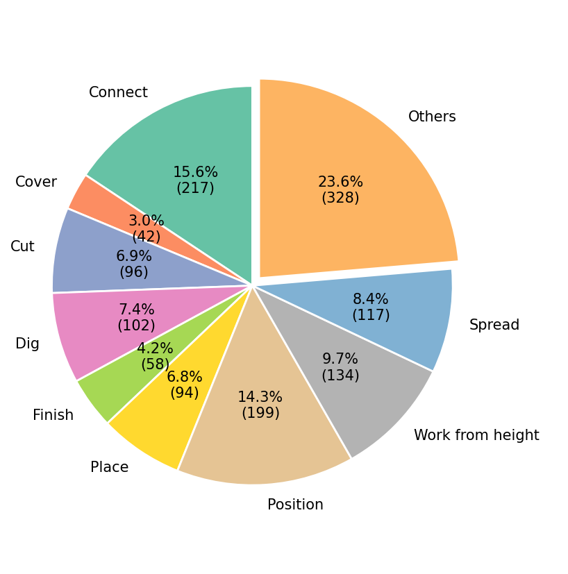

Action overview:

| Action Type          | Construction Actions                                                                                                                                                                                          |
| -------------------- | ------------------------------------------------------------------------------------------------------------------------------------------------------------------------------------------------------------- |
| **Connect**          | Assembly (squat / stand), Install, Mount driller, Nail (floor / wall), Screw (floor / wall), Wrench (squat / stand)                                                                                           |
| **Cover**            | Cover, Overlay                                                                                                                                                                                                |
| **Cut**              | Cut (squat / stand), Drill (floor / wall), Saw                                                                                                                                                                |
| **Dig**              | Backfill, Excavate, Loosen soil, Move soil (shovel / cart)                                                                                                                                                    |
| **Finish**           | Grind (floor / wall), Scrape                                                                                                                                                                                  |
| **Place**            | Drop off (squat / stand), Stack, Transport                                                                                                                                                                    |
| **Position**         | Carry, Lift item, Pick up (item / under table / long panel / panel)                                                                                                                                           |
| **Work from Height** | Climb up ladder, Climb down ladder, Operate ladder, Work from height                                                                                                                                          |
| **Spread**           | Brush (floor / wall), Paint (brush / roller / squat / stand), Pour, Spray                                                                                                                                     |
| **Others**           | Clean up, Jump from height, Measure and draw, Put on (jacket / gloves), Take off (jacket / gloves / helmet), Scroll phone, Sit (chair / floor), Stand, Stand up, Talk over phone, Walk, Walk holding big item |

Action by granularity:

| Granularity      | Action                                                                                                                                                                                                                                                                                                                                                                                                                                               |
| ---------------- | ------------------------------------------------------------------------------------------------------------------------------------------------------------------------------------------------------------------------------------------------------------------------------------------------------------------------------------------------------------------------------------------------------------------------------------------------------------- |
| **Fine-grained** | assembly_squat, assembly_stand, brush_floor, brush_wall, cut_squat, cut_stand, drill_floor, drill_wall, grind_floor, grind_wall, install, measure_and_draw, mount_driller, nail_floor, nail_wall, paint_brush, paint_brush_squat, paint_roller, put_on_gloves, saw, scrape, screw_floor, screw_wall, scroll_phone, spray, take_off_gloves, talk_over_phone, wrench_squat, wrench_stand                                                                        |
| **Coarse**       | backfill, carry, clean_up, climb_down_ladder, climb_up_ladder, cover, drop_off_squat, drop_off_stand, excavate, jump_from_height, lift_item, loosen_soil, move_soil_cart, move_soil_shovel, operate_ladder, pick_up_item, pick_up_item_under_table, pick_up_long_panel, pick_up_panel, sit_chair, sit_floor, stack, stand, stand_up, transport, walk, walk_holding_big_item, work_from_height, put_on_jacket, take_off_jacket, take_off_helmet, pour, overlay |

Statistics of each action categories:

<table> <tr> <td align="center"> 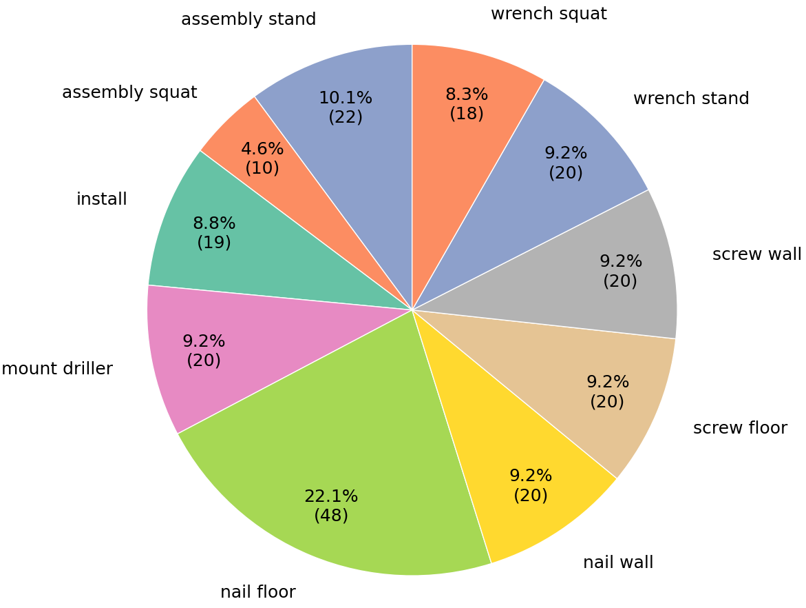  <em>Connect</em> </td> <td align="center"> 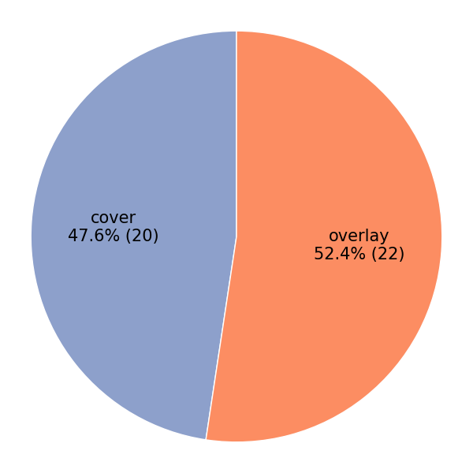  <em>Cover</em> </td> <td align="center"> 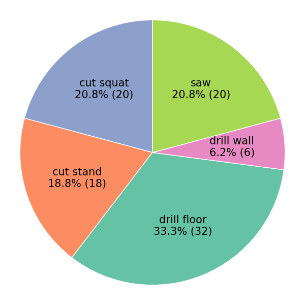  <em>Cut</em> </td> <td align="center"> 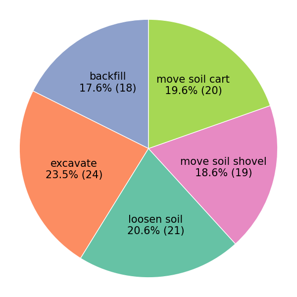  <em>Dig</em> </td> <td align="center"> 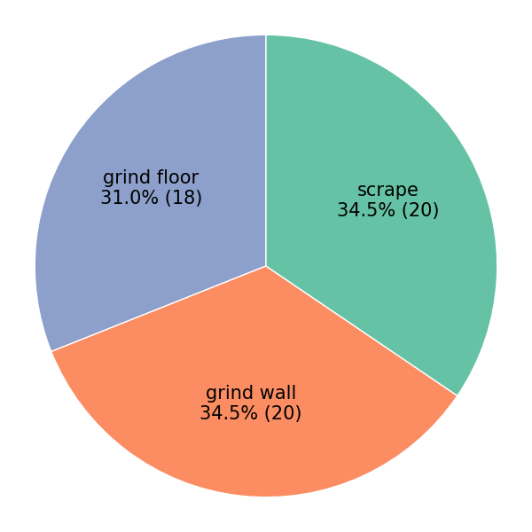  <em>Finish</em> </td> </tr> <tr> <td align="center"> 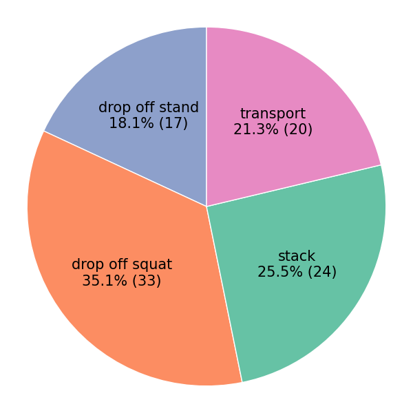  <em>Place</em> </td> <td align="center"> 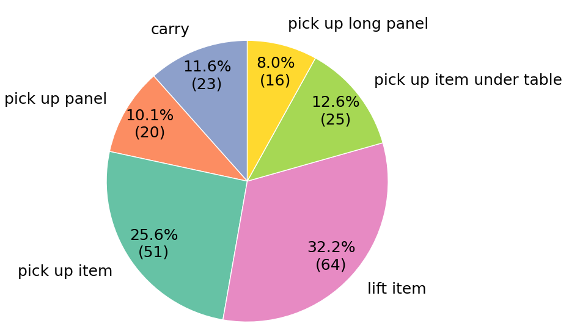  <em>Position</em> </td> <td align="center"> 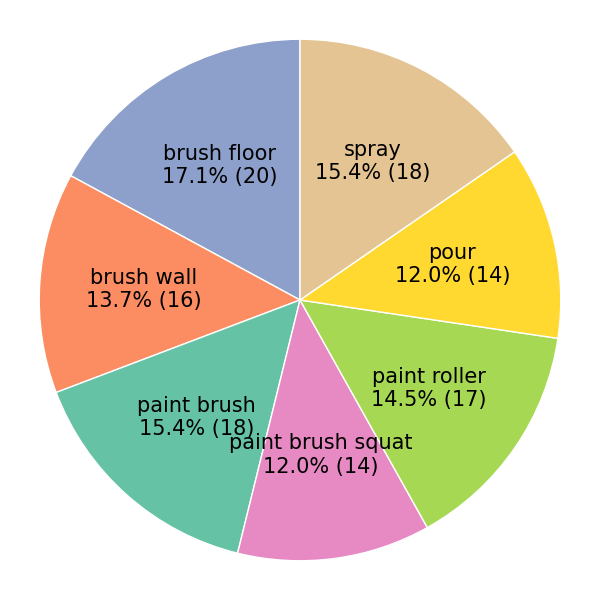  <em>Spread</em> </td> <td align="center"> 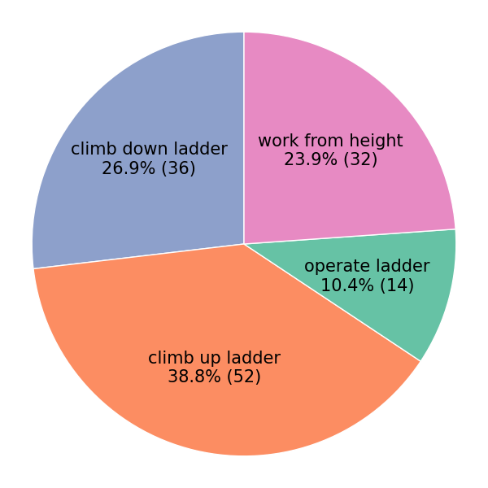  <em>Work from Height</em> </td> <td align="center"> 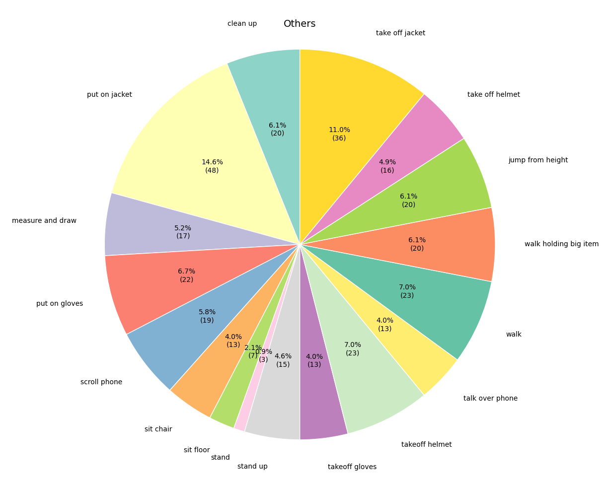  <em>Others</em> </td> </tr> </table>
